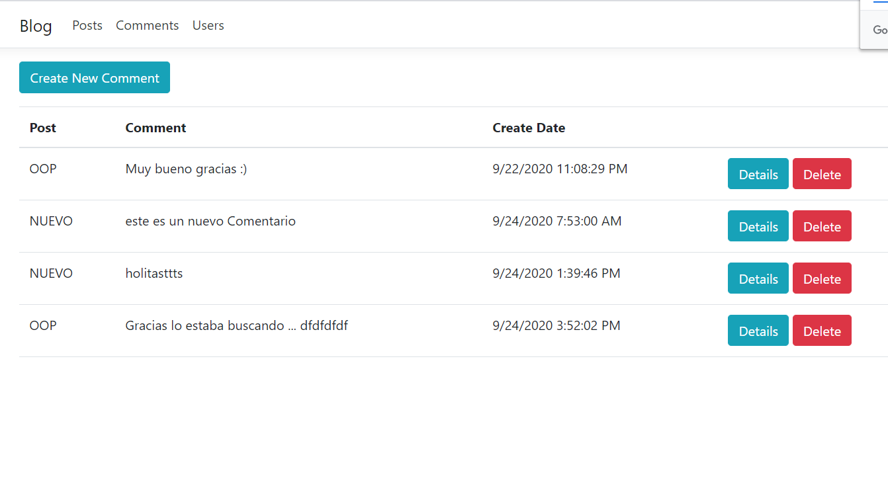
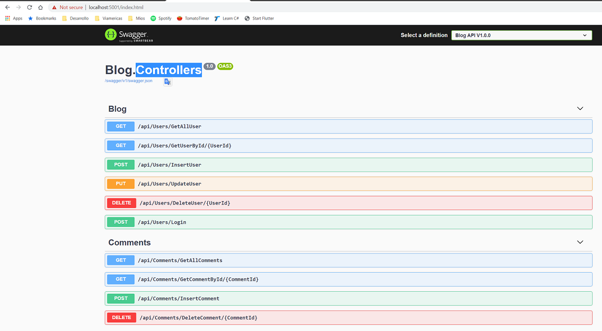

# Welcome to my Blog Project

> Hi! here you're found the documentation related to the application, design, how to release in your enviroment and important information. for that we have this sections :

- **Blog Application:** Some screenshots about app, and how's working the app.
- **Install Process:** Scripts and process to install the database, and setup the project and string connection.
- **Layers:** Short description about layers that was implemented.
- **Run** How you can run the application from an IDE.
- **Test:** How you run the testing project, where you found the mocks.
- **TODO List:** Short list of improvemnts to the next version.

## Blog Application

### UI

This is the main page when you run the project, from here you can enter in the different Modules.

- Blog: redirect to the home page
- Post: you can add, view, modified and delete a post, also you can see the comments that are related to the post.

- Comments :
  you can Add, View, or Delete a Comment

- Users:
  
  
  

### WebAPI

You can access to the WebAPI and test the differents methods that was published here. You have the specification and you can see the results of the request.

## Install Process

- The solution was developed with .Net Core version : 3.1, and you can run in Visual Studio 2019, Open Blog.sln.

In automatic way the IDE restore the libraries with NUGET package, in case that donot make this process, run the command :

`dotnet restore`

- Then you need to install the database, for that you found a script file in the repository on folder Documentation :

After to run the script you have this database

## Layers

## Run

Setup Blog.WebSite as Startup Project

## Test

## TODO List
