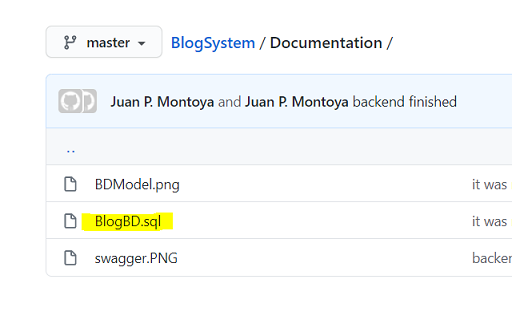
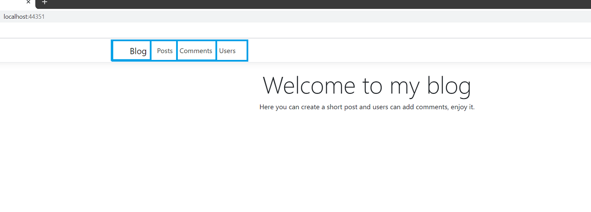
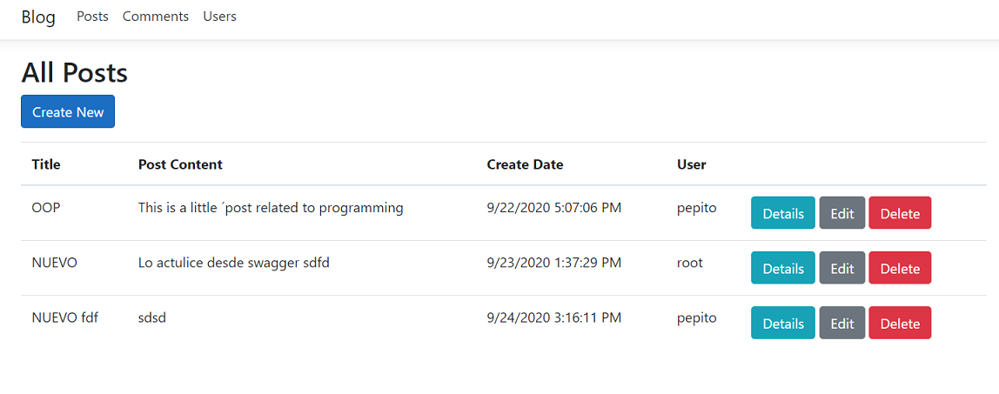
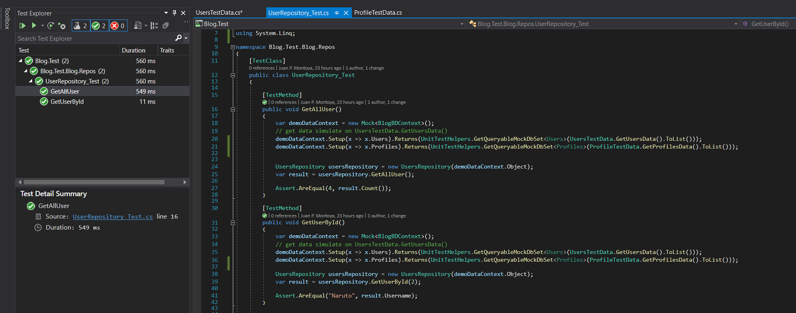

# Welcome to my Blog Project

> Hi! here you're found the documentation related to the application, design, how to release in your environment, and important information. for that we have these sections:

- **Install Process:** Scripts and process to install the database, and set up the project and string connection.
- **Blog Application:** Some screenshots about the app, and how are working the app.
- **Test:** How you run the testing project, where you found the mocks.

## Install Process

- The solution was developed with .Net Core version: 3.1, and you can run in Visual Studio 2019, Open Blog.sln.

- In an automatic way the IDE restore the libraries with NuGet package management, in case that does not restore automatically, you can run the package manager from the IDE or run the next command:

`dotnet restore`

- Then you need to install the database, for that you will found a script file in the GitHub, on folder Documentation :

- After to run the script you have this database
  

- You must Setup Blog.WebSite as Startup Project

## Blog Application

### UI

This is the main page when you run the project, from here you can enter in the different Modules.

- Blog: redirect to the home page
- Post: you can add, view, modified, and delete a post, also you can see the comments that are related to the post.

- Comments :
  you can Add, View, or Delete a Comment

- Users:
  
  
  

### WebAPI

You can access to the WebAPI and test the differents methods that was published here. You have the specification and you can see the results of the request.

## Test

The mocks are located here, and simulate post and profiles data

Here we are tesing the result of user repository.

